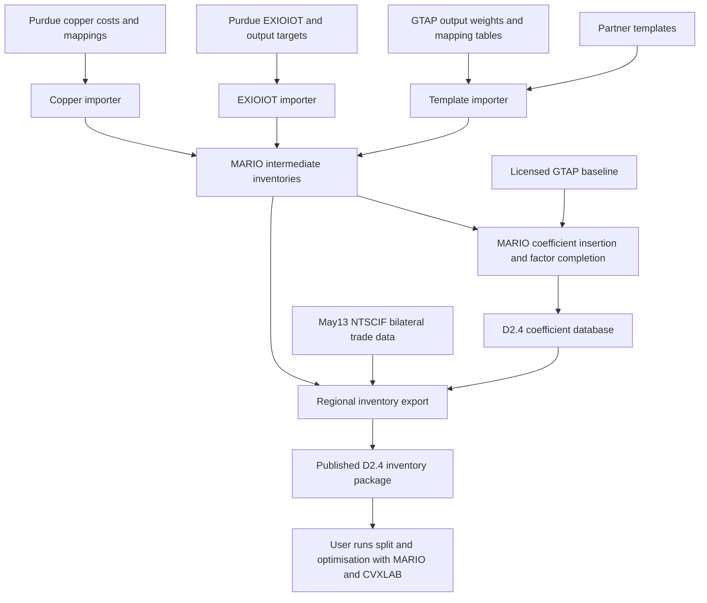

# ENTICE inventory: reconstruction and implementation plan

Updated 2 October 2026. This is the single maintained report for the D2.4 reconstruction, consistency findings, agreed decisions and work towards D2.8 and T2.6. Update it in place; do not create separate follow-up, decision or audit Markdown reports. The [repository README](../../README.md) is the installation and usage guide. CSV/JSON evidence and manifests retain their separate purpose: reproducible records that this report references.

## Current status and next steps

The published baseline and its available source chain have been identified. Project SharePoint matches the published cached values; the damaged ZIR workbook has been recovered without changing its workbook parts. Re-exporting ZIR alone reproduces its numerical records. A clean, pinned MARIO/CVXLAB environment and the native HYE coefficient replay are available. The first canonical registry is implemented: 67 published records, 21 inactive catalogue-only records, NACE-led target resolution and 163 explicit GTAP regions. The HYE geography defect has been traced and corrected in the template importer. **Full MRIO certification remains open. The GTAP baseline must remain as supplied; its accounting discrepancies are diagnostics, not an inventory-project correction task.**

The [full inventory regeneration](#full-d24-inventory-regeneration) completed on 2 October 2026 using the unchanged native MARIO workflow. All 67 distinct released sectors were recalculated from the supplied baseline and existing MARIO inputs. Their coefficient, output and trade records reproduce the operational D2.4 reference exactly. Three legacy parent-label overrides and existing numerical warnings remain visible. Verified copies use short code filenames under `Inventories/20261001` in the project SharePoint data root; originals remain unchanged.

The remaining work is implementation and controlled verification. The order below reflects dependencies, with no calendar commitments:

| Order | Concrete work | Completion evidence |
|---|---|---|
| 1. Reproducible build | Implemented: pinned installer, compatibility patches, native HYE replay, representative end-to-end check and all-sector D2.4 inventory regeneration. Remaining: full split acceptance with the baseline preserved. | All 67 regenerated inventories reproduce reference coefficients, outputs and trades exactly. The earlier reconciled diagnostic remains historical evidence only. No new baseline closure is allowed. |
| 2. Canonical sector and region registry | Implemented: three purpose-specific JSON files, Python API, CLI, explicit scope/alias warnings and canonical geography in the template importer. Classification review remains partial. | 88 identities, including 67 published records; 25 have reviewed activity definitions/options. Ambiguous aliases never select a first row. HYE regeneration restores MRT and records its estimated output. |
| 3. Transformations and diagnostics | Implement the agreed optional warning policy; make trade-source selection and normalisation/caps/factor completion traceable. Repair cluster allocation after defining units, overlaps and direct-observation precedence. | Warnings and skipped checks visible; input-to-output changes traceable; targeted regression comparisons, including HVC cluster totals and production/trade screening. |
| 4. Guided Excel pilot | Build one compact HYE workbook on the existing SharePoint, with filterable tables for metadata/sources, cost inputs, production and trade. Preserve unavailable original observations as unavailable and identify inherited baseline values. | A colleague can edit an observation in Excel; a recorded snapshot can be validated and that sector regenerated; the numerical change and any warnings can be reviewed. Assess layout/usability before migrating all sectors. |
| 5. Extend and clean | Apply the tested model to the other sectors, expose the same operations for T2.6, then trial another MRIO. Perform broad file cleanup after replacements and provenance are verified. | Reusable source data and target adapters; a two-target comparison explaining mapping, geography and valuation differences; obsolete files identified against working replacements. |

The registry now provides a common basis for the guided Excel pilot and T2.6. Next connect source observations and transformation records to it, progressively complete the remaining activity reviews, and replace legacy parent lookups during controlled sector rebuilds. Keep full-scale numerical acceptance open. The baseline-residual policy is settled: report the supplied residuals and any new extension residuals separately, without repairing GTAP.

The owner has now selected the project SharePoint for operational data and editing: `Data split/Inventory generation`. Git holds code, schemas, mappings/configuration and manifests. MARIO/CVXLAB is the selected implementation. Diagnostics are optional, with clear warnings and visible skipped checks; the final MRIO must still satisfy accounting identities within reported numerical tolerances.

Navigate to [baseline and source chain](#the-release-reference), [recovery](#why-zir-failed-and-what-was-recovered), [classification](#nace-led-parent-definitions), [consistency](#production-and-trade-consistency), [environment](#producer-environment-and-representative-verification), [Excel and T2.6](#portability-excel-and-t26), [single-sector export](#regenerating-one-sector), or [decision register](#decision-register).

## Repository integration and publication

Publication completed on 1 October 2026: [ENTICE_inventory](https://github.com/SESAM-Polimi/ENTICE_inventory) is the public code repository; [ENTICE_inventory_archive](https://github.com/SESAM-Polimi/ENTICE_inventory_archive) retains the original private history. A fresh clone from GitHub was checked before changing visibility. Its complete reachable history excludes the three file names listed below, including both historical locations of the licensed totals workbook.

The original private repository integrates all reconstruction and registry changes in merge `b5382268ccc051cac222116e7e62eb1af40ff17e`. Its first parent is the original main `14fc2bf52802ca1572efd557de15c15cf4abf77d`, also preserved by the annotated tag `backup/main-before-registry-2026-10-01`. Verified Git bundles preserve the complete history before and after integration, alongside the pre-merge working tree and staged/unstaged patches.

The public code history excludes both historical paths of the numerical `GTAP12_X.xlsx` workbook and the personal `Run.py`/`paths.yml` files. The original history remains in the private archive repository and on SharePoint. Public commit identifiers differ from the original private identifiers; a backup tag in the filtered history represents the corresponding code state without excluded files. The original main has not been lost or overwritten.

The [GTAP 12 terms, section 3](https://www.gtap.agecon.purdue.edu/databases/documents/GTAP12DataBase_TermsConditions.pdf) restrict redistribution of database values and large aggregations. Public code therefore uses externally supplied licensed inputs. The working files and historical text were checked for common credential/private-key patterns, with no matches; this is a limited check, not an exhaustive security certification. Ignored numerical data, private configuration and archived evidence are not published on GitHub.

### Project SharePoint organisation

The current operational root is `Data split/Inventory generation`. Partner submissions and `Shared sources.xlsx` are in the sibling `Data split/Data collection`. The owner reorganised the initial archive on 2 October; the configuration and source catalogue now follow that structure. The initial 1 October copy contained 1,170 files (approximately 2.47 GB), verified against source and destination SHA-256. That historical transfer is not the current folder inventory. Original eNextGen source files were retained.

| Current location | Purpose |
|---|---|
| `Data collection/PURDUE/Shared material/Cost structures` | June1 EXIOIOT and copper data; original cost container and supporting tables. |
| `Data collection/PURDUE/Shared material/Output and trade targets` | June1 `splttargs.xlsx` and its original GDX. |
| `Data collection/PURDUE/Shared material/Trades` | May13 `trade.xlsx` and its original GDX. |
| `Data collection/PURDUE/Shared material/_old/May27` | Previous delivery, preserved for comparison. |
| `Inventory generation/Classifications` | One consolidated review workbook; original specialist files under `_sources`. |
| `Inventory generation/Database/GTAP Power 2023/Original` | Original licensed Purdue CSV archive. |
| `Inventory generation/Database/GTAP Power 2023/Cache` | The eight unchanged D2.4 baseline parquet matrices and `GTAP12_X.xlsx`. |
| `Inventory generation/Data collection/Inventory cleaning` | Preserved partner/MARIO intermediate inputs, historical D2.4 inventories and coefficients. |
| `Inventory generation/Inventories/20261001` | Only the 67 regenerated inventory workbooks. |

`Repository inputs` was a staging folder, not a separate database or classification layer: it held the licensed numerical `GTAP12_X.xlsx` and personal runners. It has been removed after relocating those contents. **GTAP12_X is not a mapping:** it holds regional GTAP output totals used for weights, caps and QA. It therefore belongs beside the baseline cache, not in Classifications.

The private eNextGen `ENTICE - Documents/Inventory archive` now holds `Repository backups`, `Archive records`, `Personal runners`, `Regeneration 20261001`, `Legacy audits` and `ZIR recovery`. `Archive records` held transfer scripts and copy logs with personal paths. Their portable file roles, relative locations and hashes are recorded in Git; the raw private records stay off public GitHub. The run's fresh coefficient database and verification evidence are preserved privately, rather than deleted or shown beside partner outputs. The owner's deleted `Reference documents` and `Verification` folders were not recreated; local evidence and original source documents remain available.

The [source catalogue](../../manifests/data_sources.json) records file purposes; the [reorganisation manifest](../../manifests/storage_reorganization_2026-10-02.json) records 128 moves: 61 to private storage and 67 within the project tree. 125 were hash-verified. Three cloud placeholders were renamed without claiming content verification: `New sectors classification.xlsx` and two ICCS Costa Rica support workbooks. No numeric source data were edited.

#### What the Purdue deliveries contain

| File or group | Content and current use |
|---|---|
| `EXIOIOT.csv` | Source matrix used to derive cost structures; raw entries are not assumed to be normalised coefficients. |
| `COPCOSTS.csv`, `COPSEC.csv` | Copper cost coefficients and their sector definitions. |
| `costsup.gdx`, `costsup.xlsx` | Original mixed cost/support container and a partial Excel extraction containing sets and fertilizer shares. The Excel file is not a complete replacement for all extracted CSV tables. |
| `splttargs.xlsx` | June1 region/sector sets, output targets (`REPOUT`) and preliminary bilateral trade (`BLTTRD`). |
| `trade.xlsx` | May13 trade values and tariff data. `NTSCIF` supplies final D2.4 trades; `NTSTAR` and `MTRAT` are preserved but not used by that export. |
| `Cost structures/Supporting data` | Fertilizer use/cost shares, mineral supply observations and definition sets. Absence from the present importer does not establish obsolescence. |

May27 contains **11 byte-identical duplicates** of June1 and **four different older files**: `NFCOSTSHR.csv`, `costsup.gdx`, `splttargs.gdx` and `splttargs.xlsx`. The whole previous delivery is retained under `_old/May27`; the four differing versions were not discarded or silently merged. The existing June1-cost/output and May13-final-trade selection is unchanged. Purdue sector/HS/EXIOBASE concordances now sit in `Classifications/_sources/Purdue`.

#### Original database and derived cache

The original eNextGen `Database/GTAP 2023/12a csv/2023_csv.zip` was copied to `Database/GTAP Power 2023/Original/2023_csv.zip`, retaining its source. Its 956,283,934 bytes match SHA-256 `0e9844736cbd5cd89287fd3a0da245d4c5dcfb3dc68dcfd44754e20cdc4b51d4` on both sides and on a second source read. It contains the five original GSDF CSV tables. Member CRC checks and numerical equivalence of a fresh parse to the D2.4 cache have **not** yet been verified.

The parquet files remain necessary for reproducing the verified D2.4 baseline until that comparison is done; their presence does not establish that they are an interchangeable representation of every original GTAP delivery. `baseline_format` now selects the existing native MARIO parquet, GTAP CSV or GTAP GDX reader. CSV/GDX input must be extracted and configured explicitly; there is no silent fallback or accounting repair. GDX requires its GAMS dependencies. No MARIO source, insertion setting or numerical rule was changed. Other MRIOs may be stored as separate database directories but still require a parser and a target adapter before use.

#### One classification review workbook

`Classifications/ENTICE classifications.xlsx` consolidates **13 filterable sheets**: ENTICE sectors (88), activity scopes (33 rows), GTAP Power sectors (76), regions (163, including MRT), region-group membership (610 rows), inherited EXIOBASE bridge (345 rows), legacy concordance (178 rows), partner vocabulary (3,302 distinct rows from 36 preserved templates), the current working catalogue (187 rows), inherited CPC/NACE/ISIC source concordances (621 rows), and the unchanged operational Sector (200) and Factor of production (14) tables, plus Sources.

The workbook distinguishes reviewed NACE scopes from inherited declarations. For the 88 activities, **18 parents resolve, 7 require an activity scope and 63 remain unreviewed**. Old GTAP9/11/11Power labels are not presented as a verified GTAP12 NACE concordance. The EXIOBASE crosswalk groups sectors rather than asserting one-to-one matches; regional groups other than the complete GLOBAL universe retain their inherited review limitations. Specialist HS and other source tables remain in `_sources` rather than being flattened into misleading matches.

This is a generated review view. The maintained registry and operational compatibility workbook remain versioned in Git; editing the view alone does not change the pipeline. `scripts/export_classification_tables.py` prepares the source tables and `scripts/build_classification_workbook.mjs` builds the view with the bundled artifact runtime. Corrections should be applied to maintained source records and then regenerated. All saved rows were checked against their sources, all 13 sheets rendered for inspection, and text identifiers such as `29.10`, `01.12` and `0113` verified without truncation or loss of leading zeroes. No parent mapping was silently activated by consolidation.

#### Validation and remaining cloud limitation

All 14 configured data roles resolve after relocation. Before reopening OneDrive, SHA-256 checks confirmed that the eight baseline matrices, 68 MARIO inputs, 68 reference inventories and 67 regenerated workbooks were byte-identical to the run records. A subsequent check after reopening confirms unchanged baseline bytes and unchanged worksheet/value parts and original workbook relationships in every Excel file. Cloud-side packaging added or updated metadata/custom-XML relationships in 203 Excel containers; those hash changes do not represent numerical edits. The local preserved snapshots retain their original bytes. All 28 tests pass in the pinned producer environment. A real ZIR export through the relocated inputs reproduces 14,739 coefficient, 163 output and 1,805 trade records exactly; its technical record is saved outside the inventory folder. Future full runs use date/time output folders and local ignored build directories for coefficients and diagnostic reports. Single-sector export likewise keeps evidence separate.

The final local tree has 552 files, a longest absolute path of 384 characters and no candidates from the checked reserved-character, 255-character segment and 400-character local-path screens. Two long ICCS filenames and two MARIO filenames with reserved punctuation were shortened; readable workbook bytes are unchanged. This local screen is not certification of SharePoint's server-side paths or successful cloud sync.

OneDrive was reported closed or blocked. Seven source files initially timed out: `New sectors classification.xlsx`, `Shared sources.xlsx`, `GTAP_energy_prices.xlsx` and four Purdue Livestock CSVs. After a command to reopen OneDrive, **all seven became readable** and were hashed and inspected. Remote synchronisation is still unconfirmed.

`GTAP_energy_prices.xlsx` contains average basic energy prices in domestic absorption, USD/toe, in separate 2017 and 2023 sheets. `Shared sources.xlsx` is a reference/link index. The Livestock files contain bilateral trade and output (million USD), feed use (tonnes) and emissions (ktCO2e), on a 160-region source geography. They are distinct supporting datasets, retained in place; they are not automatically merged into the current D2.4 workflow.

The now-readable working `New sectors classification.xlsx` is **not the published workbook** used to initialise the registry. Its main catalogue has 187 rows versus 181 in that published snapshot. It contains seven additional codes (`?`, `CPH`, `FCH`, `ISC`, `QRZ`, `XNM`, `XOM`), while `XOO` appears only in the published catalogue. Three common codes have changed descriptions (MGC, NMX, PGM); no common-code parent change was found. Its split flag also differs conceptually from the published deliverable field. The unified view therefore includes this working catalogue and its CPC/NACE/ISIC declarations separately, without silently replacing published identities or treating the placeholder `?` as a valid new sector.

### Full D2.4 inventory regeneration

Run `D24-20261001` started on 1 October and completed on 2 October 2026 at 06:34 UTC. It executed steps 1–5 of `scripts/run_d24_pipeline.py` from public commit `d23e531b580450c7a08c29dd55be52bc33752141`. Only the two output destinations were replaced; the optional final QA plot was omitted. The native call remained `add_sectors(split=False, VA_fix=True, accept_non_unitary_sum=True)`. No MARIO engine, method or numerical setting was changed for this run. Hashes of the installed insertion engine, workbook reader and database API still match the prepared producer environment after completion.

The workflow read the original GTAP flow database and normal `MARIO inventories` directory, calculated fresh coefficients, saved and reloaded a new coefficient database, exported the workbooks and replaced their trade sheets with May13 `NTSCIF` using the existing runner. Previously archived D2.4 coefficients were not used as the calculation source. Experimental attempts were discarded and are excluded from these results and from the shared run archive.

**67 new workbooks cover all 67 distinct released sector codes.** The 68-file operational reference contains two MUN workbooks; both were compared with the single regenerated MUN. The empty BF-BOF natural-gas-injection source has no inventory sheet and was skipped by the existing workflow; it is not an omitted released sector. The normal MARIO inputs were used unchanged, including their existing geography. The earlier HYE/MRT pilot was not substituted into this run.

| Verification | Result |
|---|---|
| Workbook integrity | All 67 ZIP containers and worksheets read successfully; no Excel error cells, uncached formulas, missing Master sheet links or duplicate numeric keys. |
| Coefficients | 840,203 keyed records; no changed, added or removed keys against either applicable reference; maximum absolute difference 0. |
| Total outputs | 9,830 keyed records; same keys and values; maximum absolute difference 0. |
| Bilateral trades | 90,332 keyed records; same keys and values; maximum absolute difference 0. |
| Coverage | No missing or unexpected sector codes. All 68 operational reference files were readable. |
| Source preservation | All 147 data/reference files and the repository matching workbook retained their recorded SHA-256 hashes. |

The reference for this comparison is the operational D2.4 folder transferred from POLIMI/eNextGen into project SharePoint. The earlier section documents its relationship to Zenodo; this run did not download Zenodo again. Comparisons align records by database identity, unit, region and change type, rather than Excel row position or display labels. Comparison tolerances were relative `1e-10` and absolute `1e-12`; the observed maximum difference was zero for every numeric category.

Three metadata differences reproduce the current exporter's historical mapping overrides: **BVL: OTP → MVH; MSI: OXT → CHM; SOP: EEQ → ELE**. MARIO insertion still uses the source Master definitions, while the exporter resolves parent metadata through `GTAP12_matching.xlsx`. These overrides do not establish a newly reviewed NACE parent or a recalculation under the displayed parent. They remain a mapping-consistency issue to resolve separately.

Existing numerical diagnostics are preserved: **2,017 of 9,830 regional monetary profiles** fall outside `1 ± 0.01`, excluding satellite rows; 7,161 coefficient values are negative; 21 sectors have empty final trade sheets. Negative values are diagnostic observations, not automatically errors. Exact reproduction shows that these values were already in the reference. The earlier published-package count of 2,007 distinct sum warnings excluded ZIR; its ten warnings account for the difference. The native `export_d24_report.txt` describes preliminary June1 trade coverage before replacement; final trade coverage is recorded separately in `verification_summary.json`. A read-only HYE preview confirms rendering but retains the native narrow columns, which clip some labels and numbers. No workbook formatting was changed.

The run's current shared location is `Data split/Inventory generation/Inventories/20261001`: 67 files named by sector code, such as `HYE.xlsx` and `ZIR.xlsx`. Its fresh coefficient database, executed pipeline, environment/source hashes, comparison results, warning details and copy manifest have moved to the private eNextGen `Inventory archive/Regeneration 20261001`.

All 95 files (approximately 1.24 GB) were hash-verified during the original run transfer; `archive.json` retains its historical paths. The reorganisation manifest records subsequent moves. The date in the inventory directory is the run start date. No original inventory or database was overwritten. Remote SharePoint synchronisation has not been independently confirmed. Local execution evidence remains in ignored `build/rebuild_d24_2026-10-01/`.

This completes regeneration of the D2.4 inventory package with the original MARIO behaviour. It does not certify a balanced split MRIO: `split=False` was retained, existing data warnings were not corrected, and the supplied GTAP baseline was not repaired.

## The release reference

The D2.4 report, dated 30 June 2026, cites concept DOI `10.5281/zenodo.20592035`. At retrieval this resolves to the versioned record [10.5281/zenodo.20592036](https://zenodo.org/records/20592036), published on 30 June 2026. Its record was last updated on 7 July 2026; that metadata date alone does not establish whether files changed.

| Property | Verified value |
|---|---|
| Archive | `D2.4 Data Inventories.zip` |
| Size | 41,027,273 bytes |
| Zenodo MD5, independently matched | `0bdd89a38b3a882c89051795d622caeb` |
| Independently calculated SHA-256 | `c137eb656d950abba678c01f59b1ec45d14eb9d0af2784d081cf584d82ad147e` |
| Contents | 68 inventory workbooks and `New sectors classification.xlsx` |
| Readable inventory workbooks in the original archive | 67; ZIR has since been recovered separately without replacing the published file |
| Distinct sector identities | 67 including recovered ZIR; the original readable-only audit covered 66, with MUN present twice |

The [published release manifest](../../manifests/d24_published_release.json) records each member's hash, its parse status, and the fixed download URL. The original downloaded ZIP remains unchanged under `build/audits/d24_baseline_2026-10-01/`.

The dataset metadata records `CC-BY-NC-SA-4.0`. The PDF report has a separate CC-BY-4.0 statement. Code, report, inventory data and licensed GTAP inputs must retain their respective provenance and licence metadata; the report's statement is not used as the inventory dataset's licence.

## What has been preserved

The [candidate source manifest](../../manifests/d24_source_candidates.json) records 193 captured files, using paths relative to the shared ENTICE root. All 193 were successfully read and copied into a local evidence snapshot. They comprise:

- 36 partner workbooks, 68 MARIO intermediate workbooks and 68 SharePoint D2.4 workbooks;
- four existing audit reports and two manual-check/startup files;
- 11 selected Purdue inputs covering May13, May27 and June1;
- the D2.4 report and signed grant agreement;
- `X.parquet` and `units.parquet` from the baseline `2023entice` database.

The snapshot also preserves the available ENTICE Git revisions, the pre-existing working changes, current inspected modules and mappings, and MARIO/CVXLAB repository states. These are **candidate sources**, not a claim that the captured working copy is the original delivery environment.

Two existing audit CSVs changed modification time during capture after initially being cloud-only. Their captured bytes subsequently matched a fresh read of the source files. The original metadata-change flags remain in the manifest; they are not silently treated as proof of a content change.

Large evidence files, source data and numerical audit reports are in the already ignored `build/` directory. The manifests and this report can be versioned without adding those payloads to Git. The GTAP totals workbook is supplied through the private shared archive and excluded from public Git history. Original input data and source workbooks remain unchanged. Subsequent changes added workbook recovery, a single-sector export command, atomic exporter saves and visible Python warnings; these are described below. Redundant Markdown reports have been consolidated here. The reconstruction and registry work is committed for integration; no data release has been published.

## Reconstructed data chain



This separates inventory production from the subsequent balanced database disaggregation. The committed D2.4 builder and current runner call `add_sectors(split=False, VA_fix=True, accept_non_unitary_sum=True)`. The public example calls `split=True`. Finding optimisation constraints in MARIO therefore does not show that they were executed during the D2.4 inventory export.

| Stage | Available evidence | What is established |
|---|---|---|
| Partner collection | `Partner inventories`, original ancillary material, `template_checker.py` | Inputs include cost profiles, regional output observations, sources and mappings. Layout and naming remain heterogeneous. |
| Template processing | `template_to_inventory.py`, region clusters, matching and GTAP totals | Maps inputs, creates coverage profiles, estimates/caps output, and can append residual input clusters. Some implemented rules diverge from comments/report; see checks. |
| Purdue processing | EXIOIOT/COPCOSTS, `splttargs.xlsx`, mappings | Current importers map cost items, aggregate and normalise cost structures, and read output targets. Current copper code is untracked at capture and absent from the last committed ENTICE revision. Its delivery-time provenance remains open. |
| Intermediate inventories | 68 `Add_sector_*.xlsx` files | Provide an operational, pre-export layer. They already contain target-specific transformations and are not raw observations. |
| Coefficient construction | D2.4 builder, MARIO insertion/factor code | Uses the GTAP baseline with `split=False`; parent-derived coefficients and factor completion can affect resulting inventories. |
| Final coefficients | Exporter's `aggregate_sector_coefficients` | Aggregates intermediate-input coefficients over supplying regions, retains producing regions, and exports factor/satellite rows separately. Input origin becomes `GLOBAL`. |
| Final output targets | Intermediate `Total outputs` and published workbooks | For every readable published workbook, all shared regional output values and unit labels exactly match the corresponding intermediate workbook. Export may omit regions without rendered inventory rows. |
| Final trade targets | May13 `trade.xlsx`, sheet `NTSCIF` | All 46 readable published files with trade rows exactly match this source after the exporter's sector/region/zero filtering. The other 21 readable files also match its empty result. The 46 files include both MUN copies. |
| Published release | Versioned Zenodo ZIP | Hash-verified distribution reference, including its defects and duplicate files. |

### The GTAP reference

The captured baseline output matrix contains 163 regions and 76 sectors, or 12,388 region-sector observations. Every `GTAP12_X.xlsx` entry matches `2023entice/X.parquet` within an absolute difference of `1e-8`; the maximum observed difference is approximately `9.31e-9`. This supports using that workbook as the output reference for this audit.

The original audit did not load or recompute the full baseline matrices. The subsequent ZIR export read the required columns from saved D2.4 coefficients and recorded original-file and projected-file hashes. The later [full inventory regeneration](#full-d24-inventory-regeneration) recalculated all 67 sectors from the supplied baseline and MARIO sources; balanced split acceptance remains unverified.

## Project folder versus Zenodo

The additional folder inspected is `RCD-Entice-EXT - Documents/General/2.Deliverables and Milestones/WP2. Improved data and empirics on trade and climate/D2.4 - Enhanced GTAP database (M18)/D2.4 Data Inventories`. Its sibling `New sectors classification.xlsx` was also inspected.

- All 67 readable inventories match the published sheet names, cell coordinates and cached values.
- The classification workbook also matches those values.
- These 68 readable files differ in their container bytes; file dates alone do not establish numerical changes.
- ZIR is byte-identical to the unreadable published ZIR.
- Refreshed [Zenodo record 20592036](https://zenodo.org/records/20592036) still reports the same archive checksum and size as the preserved download.

The captured files, cell-level comparisons and refreshed metadata are under `build/audits/d24_followup_2026-10-01/`. This comparison does not assert equality of formula expressions, formatting or all Excel objects.

The original POLIMI/eNextGen D2.4 folder was also captured: all 67 readable published workbooks match its sheet names, cell coordinates and non-empty cached values, although all 68 inventory file hashes differ. Its readable ZIR copy was subsequently compared with the recovered published file and has the same cached values. Neither shared source folder has been overwritten.

## Why ZIR failed and what was recovered

The XLSX is a ZIP container. Its 194 local file entries are complete and pass their CRC and uncompressed-size checks. All XML parts parse and their internal relationship targets exist. The central directory begins at byte 805,588, but the file ends at byte 809,758, in the middle of that directory, without an end-of-directory record.

`scripts/repair_xlsx_directory.py` rebuilt the directory while preserving the original local headers and compressed payload bytes. The recovered file is 820,377 bytes and opens with 171 sheets. Every workbook part is unchanged; its cell values also match the previously preserved POLIMI/eNextGen copy. This is container recovery, not a recalculation or replacement with guessed data.

The exact operation that truncated the file cannot be identified from its bytes. An interrupted save, copy or synchronisation is possible. The verified outer Zenodo ZIP contains this damaged payload, and the project folder contains the same bytes: the defect is not explained by a bad local download alone.

The recovered workbook and its per-part recovery manifest are now preserved in the private eNextGen archive:

```text
Inventory archive/ZIR recovery/2026-10-01/
  ZIR - Manufacture of refined zinc.xlsx
  ZIR - Manufacture of refined zinc.recovery.json
```

This is a reviewable recovery candidate. Publishing a replacement or a new Zenodo version remains a separate release action.

## MUN and identity management

Both MUN files contain the same sector code, description, NFM parent, regional coefficients, output and trade. Their `DB units` catalogues differ: the filename without the comma contains 127 sectors; the filename with the comma contains 143. The latter has 16 additional sector entries. Consequently, the files are not identical apart from their names.

The historical exporter constructed output filenames from the intermediate filename's descriptive text and did not remove previous filenames. The current exporter uses stable sector-code filenames and new run directories. That historical naming behaviour could leave two MUN files after a description changed. The different unit catalogues support different database/export states; the exact rename event has not been recovered. There is no evidence here of two different intended MUN activities or competing MUN parents.

Use one stable sector identity, keep alternate names as aliases, and create each release in a fresh output directory. For this baseline, the comma version's catalogue is consistent with the 143-sector database used in the single-sector trial. The original files remain preserved; no silent deletion has been made.

NMC and NCM require more care: their published parents are OME and EEQ respectively, and 14 of 162 common regional outputs differ. They are not interchangeable duplicate files. PLSR appears to be a legacy spelling of catalogue code PLS, but that inference is not evidence that either activity was withdrawn.

## NACE-led parent definitions

The review uses **NACE Rev. 2**, matching the delivered classification's version, with product detail where a broad activity name is ambiguous. NACE Rev. 2.1 is a distinct version and must not be substituted implicitly. Target parents follow a versioned NACE–ISIC–GTAP bridge. [Eurostat version guidance](https://ec.europa.eu/eurostat/web/nace) and the [official GTAP GSC3 concordance](https://www.gtap.agecon.purdue.edu/databases/contribute/concordinfo.asp) establish this basis.

The [review table](../../data/classification/d24_nace_review.csv) records all 67 published identities, preserves duplicate catalogue rows, and gives 24 targeted scope determinations. Untargeted rows are explicitly not certified at class level. This table is review evidence, not a new silently active production mapping.

| Activity | NACE Rev. 2 scope | Appropriate GTAP parent | Finding |
|---|---|---|---|
| BVL, light-duty motor vehicles | 29.10 | MVH | Published OTP is incorrect for this activity. |
| MSI, silicon | 20.13 | CHM | Published OXT is incorrect; HS 280469 identifies silicon, not extraction. |
| SOP, photovoltaic components/modules | 26.11 | ELE | Published EEQ is inconsistent with this scope. |
| AGT, artificial graphite | 23.99 | NMM | Published parent is appropriate; competing CHM catalogue/NACE entries must be reconciled. |
| MGC, magnesite and the listed magnesia products | 08.99 | OXT | Official product detail includes the processed magnesia forms; the two name variants are an identity issue, not evidence of a second parent. |
| PCP, coke | 19.10 | P_C | Both matching rows agree on the parent; different source aliases should be separate from the sector registry. |
| NMC/NCM, batteries | 27.20 | EEQ | NMC's OME is inconsistent with battery manufacture; selection/alias history remains distinct from classification. |
| GAR, gallium metal | 24.45 | NFM | Chemical-parent/source assumptions conflict with the stated metal and HS scope. HS 811292 also covers other metals and requires a narrower product allocation. |
| WNT, turbines and turbine-generator sets | 28.11 | OME | Distinguish these from separate electrical generators, 27.11 → EEQ; WNT is currently reused for both names. |

The silicon determination is supported by the [official silicon product entry](https://eur-lex.europa.eu/legal-content/EN/TXT/?uri=intcom%3AC%282021%298413). Artificial graphite is explicitly classified under CPA 23.99.14 in the [official product list](https://eur-lex.europa.eu/eli/reg/2019/1933/oj/eng). [NACE explanatory notes](https://sfc.ec.europa.eu/system/files/documents/sfc2007/2022-10/nace-rev-2.pdf) distinguish turbines, generators, secondary-metal production and materials recovery. [The 2022 product classification](https://eur-lex.europa.eu/legal-content/EN/TXT/?uri=CELEX%3A32022R2552) supplies detail for magnesia and photovoltaic/chemical products.

Other important scope findings:

- ZIR's HS 281700 covers zinc oxide/peroxide, with CPA 20.12.11: CHM is appropriate for that chemical scope. Zinc metal would instead require NACE 24.43 and NFM. COR, MNR, TIR and other misleadingly named refined-material inventories also use chemical-product trade definitions. Names must state that scope.
- PLR/RAL/RCP cannot inherit a manufacturing parent just because their recovered material is plastic/aluminium/copper. Materials recovery at 38.32 maps to WTR; actual secondary-metal manufacture maps to NFM. Products made from recycled material and recovery services must not be merged or double-counted.
- PLP needs a product definition: plastics in primary forms, 20.16 → CHM, differs from finished plastic products, division 22 → RPP. PLSR/PLS similarly needs an activity definition in addition to an alias decision.
- Several vehicle concordance entries include both divisions 29 and 30, even though ordinary road vehicles belong in 29. RER combines metal and compound trade categories; a single parent cannot be assigned by ignoring that difference.

These are categorical rules for defined activities, not requests to choose a convenient parent. Where a source mixes activities, the remaining work is to separate or explicitly delimit its scope, then rebuild target-dependent quantities and coefficients.

### Implemented canonical registry

The registry has three files with separate responsibilities:

| File | Role |
|---|---|
| [sectors.json](../../data/registry/sectors.json) | 88 stable records: the 67 published codes plus 21 catalogue-only codes that remain inactive. Namespaced source aliases, NACE version and activity scopes, related-but-unmerged records, evidence references. |
| [gtap12.json](../../data/registry/gtap12.json) | Versioned target adapter. NACE rules determine parents. Published parents, matching rows, declared concordances and file hashes are retained as historical evidence. Rebuild dependencies are explicit. |
| [regions.json](../../data/registry/regions.json) | 163 GTAP region codes/names and 32 explicit groups from the common region reference. These are GTAP geographic units, including aggregates, not an ISO country list. `GLOBAL` must contain all target regions exactly once. |

The [Python API](../../src/entice_inventory/core/registry.py) and [CLI](../../scripts/registry.py) read these files directly. Identity resolution requires a namespace for source aliases. Shared source labels such as `XCH_BPH` cannot silently select one sector. Both MUN filenames resolve to MUN; NMC/NCM and PLS/PLSR remain separate related records. Catalogue absence does not establish withdrawal and querying an entry does not activate it.

The registry carries the previous 24 targeted definitions plus HYE: hydrogen is PRODCOM 20.11.11.50, under NACE Rev. 2 20.11 and ISIC Rev. 4 2011, hence CHM in the reviewed GTAP bridge. This follows the [official product classification](https://eur-lex.europa.eu/legal-content/EN/TXT/PDF/?uri=CELEX%3A32022R2552) and [NACE notes, printed page 140](https://sfc.ec.europa.eu/system/files/documents/sfc2007/2022-10/nace-rev-2.pdf). The electrolysis/steam-reforming distinction remains important for source profiles even though both activities belong to the same class.

Of the 67 published records, 18 currently yield a parent for a defined scope, seven require scope resolution and 42 remain unreviewed at this level. The 21 catalogue-only records also remain unreviewed. A missing determination returns `parent: null` with a reason, never the old parent as a fallback. Conditional scope selection is exposed as conditional, not treated as certification of its observations. Five resolved parents differ from the release: BVL, GAR, MSI, NMC and SOP. Source/name alignment warnings remain separate from parent changes. EXIOBASE has no adapter yet.

Diagnostics are optional and produce structured warnings with identifiers, source records, observations, references and suggested actions. Skipped checks are listed. Invalid data structure, unreadable workbooks and ambiguous identity requests are technical failures, not successful validations. All 68 preserved MARIO workbooks have been inspected read-only with the new checks; detailed findings are in `build/registry/inventory_diagnostics.json`. These warnings do not themselves establish that incomplete coverage is an error for every sector.

**Integration boundary:** the template importer now uses the canonical geography. Existing importer/exporter parent lookups still use the historical matching workbook; switching all of them without rebuilding dependent coefficients would be misleading. New code can obtain NACE-derived parents directly from the registry. The old review CSV remains preserved evidence and must not be maintained as a competing live mapping. Usage is in the repository README.

### Mauritania: cause, correction and verification

The common `Regions_clusters.xlsx` contains MRT at `Sheet1!A142:G142`, including GLOBAL membership. The preserved partner HYE template's internal `Region` reference table omits MRT entirely. The old template importer built its target universe from that internal list, propagating the omission to GLOBAL, synthetic producing-region coverage and Total outputs. This is not evidence of a deliberate geographic exclusion.

The importer now takes its target region universe from the canonical registry and warns when a partner reference list is incomplete. A private HYE regeneration now covers all 163 regions in GLOBAL and Master expansion, and includes MRT in Total outputs. Its output is approximately **0.00417905 M USD**, generated by the existing median-ratio estimation rule. The row explicitly identifies the method and source and states that it is an estimate. No new Mauritanian production observation was found. The conflicting HYE Summary description remains visible as a separate warning.

The read-only scan found MRT as the sole missing GLOBAL member in **24 of the 68** preserved intermediate workbooks. Eight others omit XWS (Rest of Western Asia); the remaining 36 have complete GLOBAL membership. Correction must be applied through source regeneration and coefficient reconstruction, not by editing the published GLOBAL list alone. Only the HYE intermediate has been regenerated as a verification candidate in this step; this does not certify a new D2.4/HYE final workbook. Original partner, intermediate and common-region reference hashes remain unchanged. Evidence and the private candidate are in `build/registry/hye_verification.json` and `build/registry/hye_candidate.xlsx`.

Verification covers the registry's identity/scope resolution, ambiguous aliases, invalid parents, NACE versions, skipped checks, geography integrity and read-only workbook diagnostics. The repository's 20 tests pass, including the existing producer/recovery checks. A separate HYE source regeneration exercises the real importer and verifies full coverage, the MRT estimate and unchanged source hashes. A built wheel was installed in an isolated target directory and successfully loaded the bundled registry from outside the checkout. This is not a full MRIO rebuild.

## Production and trade consistency

The original numerical audit covers 67 readable published workbooks, excludes the then-unreadable ZIR, and includes both MUN files unless explicitly deduplicated. Recovery has not silently expanded these historical counts.

In the inspected producer, there is no dedicated pre-export check that compares the sum of a commodity's exports against its total output. `build_trade_rows` filters diagonal, negligible and out-of-coverage trade rows, but does not compare trade with production. The subsequent May13 trade replacement also performs no production feasibility check and does not refresh the earlier export report.

MARIO's split implementation validates split metadata and quantities, checks new output against parent output and checks for negative residual parent output. Its CVXLAB model then constrains total supply/use and observed bilateral trade jointly. In the inspected `model_settings.xlsx/problem`, these are the production/column constraints and the trade constraints labelled 2, 3 and 4. These are optimisation constraints, not a separate diagnostic explaining incompatible trade/output inputs.

The D2.4 builder invokes `split=False`; those split/optimisation checks do not validate the exported package during that producer run. The public consumer example invokes `split=True`, so inconsistent targets can surface later, when a user attempts to solve the model.

For a commodity produced in region r, under a common valuation and scope and non-negative domestic allocation:

```text
sum of observed exports from r <= total output in r
```

This is a useful necessary-condition screen, not a universal rule for unharmonised customs data. Re-exports, CIF versus domestic producer valuation, trade margins, commodity/activity scope and different reference years must be reconciled first. Negative inventory changes can also affect simple non-negativity assumptions. Solver tolerances need to be applied in the direction of the actual model inequalities before claiming infeasibility.

`output + observed imports - observed exports` is recorded as a descriptive diagnostic. Imports may be incomplete, so a negative value is not by itself proof of negative actual domestic consumption. Global exports equal global imports when summed from the same bilateral table by construction; that identity cannot independently establish consistency with production.

### Observations in the published package

- 2,606 workbook-region entries have observed exports above output at the audit threshold; this is 2,575 distinct sector-region pairs after removing the duplicated MUN observations.
- Of these distinct pairs, 1,768 have reported output equal to zero and positive observed exports.
- Example: AGT/BEL has output 8.1212720871 M USD and observed exports 9.5301914814 M USD. Both values were independently checked with openpyxl.
- The numerical trade source is May13 NTSCIF, explicitly labelled CIF imports scaled to GTAP. Matching unit text `M USD` alone does not establish equal valuation.
- All final trade endpoints are inside the exported coverage because the exporter filters them. The absence of endpoint errors does not show that no source flows were discarded.

These are screening flags for review, not 2,575 confirmed data errors. The audit records observations without modifying them.

## Existing checks and their execution

| Check or behaviour | Implementation | Existing execution / limitation |
|---|---|---|
| Sector, region and factor cluster membership | `template_checker.check_*_clusters` | Returned as issues by the parser. The personal runner can block on selected lists, but `perform_checks=False` in the captured runner. |
| Unit-process identifiers and mapped inputs | `check_unit_process_region_names`, `check_unit_process_inputs` | Same optional runner gate. These checks do not establish economic correctness of a mapping. |
| Monetary profile selection | `read_unit_process` | Always applied during parsing; non-monetary profiles are discarded with warnings. |
| Monetary coefficient sum | `read_unit_process` | Tolerance `1e-3`; non-unitary regional profiles can be discarded, all-zero profiles kept with warnings, GLOBAL retained as fallback. The runner's blocking list omits `unit_process_columns`. |
| Production-region identifiers | `check_total_production_regions` | Optional runner gate. |
| Production against GTAP parent | `check_total_production_vs_gtap` | Only computed when `gtap_path` is supplied. The generator calls `parse_template` without it. The optional runner prints violations but does not include them in its `all_ok` decision. |
| Coverage gaps | `check_missing_regions` | Returned/printed for diagnosis; not a comprehensive mandatory acceptance gate. |
| Missing/non-numeric production | `read_total_production` | Converted to `0.0`; this is a transformation, not successful validation. Non-zero GLOBAL production rows are skipped. |
| Cluster-level production allocation | `template_to_inventory.make_inventory` | Comments and D2.4 section 3.5 describe allocation by parent output. In both HEAD and the working copy, the detected `_matched_cl` is not used in the output-resolution loop; execution falls through to median estimation. Requires reconciliation. |
| Individual production cap | `make_inventory` | Caps some template-derived direct values against parent output; no equivalent full sibling-envelope gate is established for the producer. |
| EXIOIOT/COPCOSTS input resolution | Their importers | Missing mappings, zero-total cost structures and missing regional cost coverage can raise errors; malformed/near-zero input rows may be skipped and surviving coefficients normalised. |
| Residual input shares | `apply_residual_sector_clusters` | Rescales existing rows and appends an input cluster; the captured runner requests 1%. This is a methodological modification, distinct from the residual parent sector after splitting. |
| MARIO factor completion | `add_sector_engine`, `VA_fix=True` | May add parent factor values and rescale inventory rows. With `accept_non_unitary_sum=True`, non-unitary inventories proceed with warnings and zero-total inventories are skipped. |
| Split quantity/schema validation | `add_sector_split.normalize_split_info` | Invoked in the split workflow, not the D2.4 `split=False` exporter. Negative checks do not constitute complete numeric validation because coercion to NaN is not itself rejected there. |
| Individual and combined output envelope | `add_sector_split.build_split_scenario` | Individual child-parent comparison and rejection of negative residual parent output. Conditional on running the split stage. |
| Missing versus zero bilateral trade | `cvxlab_bridge` and `Trade_selector` | Missing values in an internal dense table become zero, but selectors activate only explicitly supplied trade rows; absent observations are not automatically imposed as zero constraints. Upstream export discards explicit near-zero rows, so their original meaning cannot be recovered from the release alone. |
| Joint output, trade and accounting constraints | CVXLAB `Split_sectors/model_settings.xlsx` | Enforced when optimisation runs; infeasibility or success is not a substitute for interpretable preflight checks and post-solve residual reports. |
| Solver outcome | `optimize_split_in_cvxlab` | Checks solver status before loading results. No delivery-time solver log was found. |
| Missing trade, empty inventories, coefficient sums | Exporter's `write_export_report` | Text report, not a release-blocking gate. Its sum checker includes all written rows, including satellite accounts with different units. |
| Parent label comparison | `plot_d24_split.check_parent_consistency` | Diagnostic function exists; not invoked by the end-to-end runner. |
| X/VA split charts | `plot_d24_split` | Uses selected/mixed sources, can substitute zero for missing VA, and clips plotted residuals with `max(parent - children, 0)`. Charts do not certify non-negative regional residuals or solver feasibility. |

Relevant production files are under [inventory](../../src/entice_inventory/inventory/), [export](../../src/entice_inventory/export/), [core](../../src/entice_inventory/core/), and [the runner](../../scripts/run_d24_pipeline.py). Dependency code inspected is preserved in the local source snapshot, with Git revisions in the candidate manifest.

## Independent consistency results

| Audit | Result | Scope and interpretation |
|---|---|---|
| Output lineage | No changed values or unit labels on common regions | Applies to readable published files matched by code to one intermediate inventory. Regional omission is listed separately. |
| Catalogue consistency | BVL, MSI and SOP parent conflicts; NMC/PLSR missing | Compared with the classification included in the same release; do not silently relabel output in this audit. |
| Current runner lookup | PCP and MGC ambiguous | Current matching contains multiple rows for these codes. |
| Intermediate metadata | AGT Master/parent disagreement in 163 rows | Summary and Master are not consistent. Current parent overrides may conceal the historical discrepancy. |
| Intermediate completeness | SGI has no regional inventory sheets | The current exporter skips it; absence must remain visible in release coverage. |
| Monetary sums | 2,051 of 9,830 parsed regional sheets outside 1 ± 0.01 | 2,007 distinct sector-region profiles after removing the MUN duplicate. Satellites are excluded. This is an independent screening result, not the exporter's mixed-unit sum. |
| Individual output envelope | 23 entries exceed parent at the strict audit threshold | 14 exceed the parent by more than 0.01%; the rest need precision review. Reference output workbook matches the captured baseline X matrix. |
| Combined output envelope | 44 parent-region groups exceed the envelope | Uses declared published parents; both ambiguous MUN copies are omitted and ZIR was excluded from this original audit. Thus it is incomplete. Alias conflicts and parent disagreements also affect interpretation. |
| Original template checker | All 36 workbooks parsed; 33 produce at least one diagnostic | Includes unused/example cluster definitions and warnings; do not interpret every diagnostic as a defect in a delivered sector. |
| Production header layout | Six templates have repeated `2023 Value` headers | The current parser takes the last exact match and defaults the unit column to H if `2023 Unit` is absent. This needs explicit disambiguation. |

The strict output/trade screen uses `max(1e-8, abs(output) * 1e-8)` as a numerical comparison allowance. This is an audit threshold, not a calibrated economic tolerance or a substitute for the solver's tolerance settings.

Examples of material individual-envelope flags are CPP/COD (about 1.2401 times its declared parent's output) and TIR/MOZ (about 11.5199 times). Their cause is not assigned by this audit. The current producer's template cap cannot be assumed to protect all source pipelines.

The original checker returned 247 unit-process-column diagnostics, 62 production-versus-parent violations, 21 unresolved production-region references, and other mapping/cluster issues. Detailed per-file records are preserved in `template_checks.json` and `template_issues.json`. The template layout scan found no formula errors or uncached formulas in the columns selected as 2023 output values; that does not validate the selected columns' meaning or units.

## Trade source policy and tolerances

### Observed trade lineage

The May13 `NTSCIF` header describes **imports at CIF prices, scaled to GTAP, in M USD**. This valuation label is not carried into a structured valuation field in the final workbooks, which say `M USD`.

The committed exporter reads June1 `splttargs.xlsx/BLTTRD`. The current working tree adds `update_trades_in_exported_inventories`, which replaces the trade sheets using May13 `NTSCIF`. The published files match the latter, not the former, wherever published trade is present. This establishes the numerical source, but does not date or identify the exact code execution that performed the replacement.

For four sectors the sources lead to materially different coverage:

| Sector | June1 rows retained under the published region filter | Published trade rows |
|---|---:|---:|
| CPP | 955 | 0 |
| CPS | 273 | 0 |
| LIT | 410 | 0 |
| REE | 370 | 0 |

These counts describe coverage, not a complete source-selection decision. The review below identifies paired-source candidates and remaining metadata gaps. An empty trade sheet is missing evidence, not a claim of zero trade.

### Selection policy and tolerance settings

Among the 66 distinct readable published codes in the original audit, the existing coverage filter yields 28 with observations in both sources, 17 with May13 only, four with June1 only, and 17 with neither. ZIR was excluded from these original counts. June1-only codes are CPP, CPS, LIT and REE.

The mismatch is partly taxonomic: May13 includes composite codes such as `RRE_LIT`, `CPR`, `ALM`, `LBT` and `HYD`, rather than every disaggregated child code. A composite observation must not be copied into each child or added to child observations. June1's shared output observations match the published CPP, CPS and LIT values exactly, making it a strong candidate for their corresponding trade targets. REE has output differences and needs a paired production/trade review.

The D2.8 source-selection policy should preserve both sources, use explicit per-sector/product mappings, select a preferred observation for each overlapping key and keep its provenance. Use June1's child-specific observations as candidates where May13 only has aggregates; retain May13-only evidence where its scope matches. For overlaps, valuation/year/coverage consistency determines preference, not whichever value happens to pass a numerical check. June1 BLTTRD has no valuation/unit description in its header; numerical plausibility cannot fill that metadata gap. No blanket replacement or unqualified union has been applied.

The agreed validation direction is captured in [validation-policy.json](../../config/validation-policy.json): checks are optional, warnings remain visible and skipped checks are listed. It is a policy artifact, not yet wired into the full production runner. Technical failures cannot be reported as successful exports.

The standalone exporter no longer globally suppresses Python warnings. The single-sector command warns that a metadata parent override does not recalculate coefficients.

For exploratory output/export screening, the initial configurable threshold is `exports > output + 1e-6 M USD + 1% × abs(output)`. This is a review threshold, not an assumed statistical error band. In the original audit scope it flags 2,556 distinct sector-region pairs; even a 5% relative tolerance leaves 2,538. Tolerance alone does not resolve missing output, valuation or scope problems.

The final MRIO must satisfy its supply/use and column-accounting identities within explicitly reported solver tolerances. Output equals domestic use plus exports under the appropriate origin accounting, not exports alone. Observed output/trade targets can have configurable absolute/relative bands or penalties, with every adjustment reported. Diagnostic tolerances, empirical uncertainty and solver numerical tolerances are separate parameters.

## B07 and B10: why code decisions still need review

B07 is partly about making transformations explicit, and partly about whether they implement the intended method. Code already normalises, caps, estimates and fills factors, but different entry points apply different rules. A non-unitary profile can survive one path while another rejects or rescales it. The existence of code does not establish that a published exception is intentional. Transformation logs should show original value, changed value, rule and rationale, alongside optional consistency warnings.

B10 is a concrete missing branch. `template_to_inventory.py` identifies `_matched_cl` but never uses it to allocate the cluster's output. Uncovered countries receive a median new/parent ratio instead. `_global_val_to` is likewise unused, while non-zero GLOBAL production rows are already dropped by the parser.

For HVC, the current source contains EU27 excluding Germany with a total of about 19,558.47. Replaying the current resolution logic gives about 45,465.78 across its 26 members. Austria receives about 1,517.89 from the median method, versus 652.97 under the commented parent-weighted cluster allocation. These are a current-input illustration, not an assertion of bit-identical historical replay; the published Austrian value is 1,517.9157. The parser does not provide a unit label for this row, another issue to retain before changing the method.

The scan found cluster observations with uncovered members in eight templates: APS, HVC, MSI, MTH, PLP, PLR, PLS and SOP. There are 23 cluster observations, 21 positive. A correction must define overlaps, direct observations within clusters, unit conversion and whether cluster totals are inclusive or residual. It must then report changes against the baseline. No cluster-allocation correction has been silently applied in this follow-up.

## Code provenance

| Evidence | Revision or observation | Interpretation |
|---|---|---|
| First committed D2.4 export | `f3fdc94`, 4 June 2026 | Historical candidate preserved as a Git archive. |
| Latest ENTICE commit at capture | `14fc2bf52802ca1572efd557de15c15cf4abf77d`, 8 June 2026 | Latest committed producer candidate; references the absent `MARIO inventories copy`; the owner confirmed it was an overwrite safeguard, so the normal folder can be used. |
| ENTICE working copy | Existing staged moves, modified modules/mapping and untracked modules | Material differences from HEAD include parent overrides, copper processing and the trade replacement step. |
| Public guided example before delivery | `04697834466cea3649607b5b7d87bef9599d2b16`, 10 June 2026 | Preserved fixed revision; points to MARIO branch `dev_gtap_VA`, not a pinned dependency commit. |
| Public example at audit | `81f3c077a9f514641ca17b114198189b8978266e` | July changes in the available history concern README installation instructions. |
| Local MARIO at capture | `590426673589dc474d1d23547b1d366758d7fec7` plus recorded working changes | Current inspection reference, not the certified delivery version. |
| Local CVXLAB at capture | `1f2521b52d85ca0783dca5991d697d22bfa044a3`, clean | Current inspection reference, not the certified delivery version. |

The available local MARIO `dev_GTAP_VA` and remote-tracking `dev_gtap_VA` references point to a July revision. Their names cannot recover the exact June environment. No delivery-time dependency lock, solver log, environment export, or full build manifest has been found in the inspected material.

An older existing audit covers 50 files in `MARIO inventories copy`, while the current intermediate folder contains 68. The old audit is preserved as historical evidence; its counts are not treated as findings about today's folder.

Recovering that copy folder is no longer a prerequisite. Its older 50-file audit remains historical evidence; the normal 68-file intermediate folder is the working source candidate.

## Producer environment and representative verification

The runtime is now reproducibly installable. The [installer](../../scripts/bootstrap_producer.py), [dependency lock](../../requirements/d24-producer.txt) and [source/patch configuration](../../config/producer-environment.json) create a fresh environment without inheriting system packages. Tested on Python 3.13.14, macOS arm64. This is an explicitly reconstructed integration environment, not evidence of the exact June execution environment.

| Component | Fixed reference / change |
|---|---|
| MARIO | Commit `590426673589dc474d1d23547b1d366758d7fec7`; local patch pins pandas 2.3.3 and reads both mapping-based and attribute-based CVXLAB settings. |
| CVXLAB | Commit `1f2521b52d85ca0783dca5991d697d22bfa044a3`; local patch declares the required SALib 1.5.2 dependency. |
| Numerical packages | pandas 2.3.3, numpy 2.1.1, CVXPY 1.9.2, CLARABEL 0.11.1; remaining dependencies are pinned in the lock. |
| Patch validation | MARIO's copied-template test now checks preserved model contents when the existing compatibility routine rewrites the Excel container. Byte identity is still required when no rewrite is needed. |
| Scope | The patches are retained in this repository and applied to isolated source copies. Original MARIO/CVXLAB repositories and the user's existing Python environment are preserved. Compatibility is tested for this workflow, not every MARIO feature. |

The earlier dependency conflict, undeclared SALib import and `ModelSettings.get` failure are resolved in this environment. The clean installer completes and `pip check` finds no broken requirements. Focused checks pass: 10 repository tests, 20 MARIO insertion/bridge tests and 48 CVXLAB unit tests. The integration test checks actual accounting, aggregation back to the parent, and an observed bilateral trade target; a successful solver return alone is not the assertion.

### What the HYE reconstruction establishes

The [verification command](../../scripts/verify_producer.py) has two distinct checks:

- **Native-geography replay:** independently evaluate the HYE/DEU coefficient rules against the original GTAP inputs and compare with the preserved D2.4 workbook. All 93 coefficients match within `1e-12` absolute / `1e-10` relative allowance; maximum absolute difference is approximately `2.78e-17`. This explains a regional inventory numerically, not the complete historical database build.
- **Representative software run:** aggregate GTAP to Germany plus ROW while retaining all 76 sectors, select the existing HYE/Germany profile, run MARIO insertion and the repository exporter, then consume the exported workbook in a real MARIO/CVXLAB split. The script supplies the current API's required empty Exclusions sheet and explicit Tolerances sheet. Missing HYE trade observations remain unconstrained and are reported as a skipped validation.

Two previously implicit rules explain why insertion after aggregation differs from the historical inventory:

1. `OthVA` is distributed using unweighted sums of baseline value-added coefficients across all regions and sectors. Changing the regional aggregation changes those weights. Using native geography reproduces all four published HYE/DEU factor coefficients; for example Tax is `0.1784005986438553`, while the uncorrected two-region pilot gives `0.1764123802463593`.
2. HYE's `GLOBAL` cluster contains 162 of the 163 GTAP regions and omits **MRT (Mauritania)**. The importer initially inherits the CHM parent column and replaces inputs only for covered origins. Mauritanian parent inputs therefore remain. Including that inherited remainder reproduces the published sector-input coefficients as well. Expanding `GLOBAL` to every target region would change the data.

The two-region pilot merges covered and uncovered countries into ROW, which changes that source-cluster boundary. It is a software diagnostic, not an approved migration rule. Production portability must resolve source profiles before aggregation or retain regions needed to represent source coverage. The original HYE workbook also has a conflicting Summary description (steam reforming versus its electrolysis filename/profile); the canonical registry must resolve the activity description without silently treating matching numbers as correct metadata.

### Accounting and solver outcome

The input GTAP table already has small column-accounting residuals. In the two-region aggregation, 109 of 152 columns exceed the diagnostic allowance; the maximum absolute residual is about **0.341910 M USD**. The source of these residuals has not been established. They are not automatically labelled rounding errors or caused by HYE insertion.

The earlier diagnostic experiment rescaled value added in a private copy, retaining factor shares and signs. Its recorded adjustments and results below remain historical evidence. **The owner has now explicitly ruled out correcting the GTAP baseline.** The baseline-closure function and command-line option have been removed from the current verification tool. New runs preserve the supplied values, report pre-existing residuals and report any solver incompatibility without repairing the baseline. The old experiment's largest relative factor adjustment was about `7.06e-5` (0.00706%), its largest individual adjustment about 0.183735 M USD, and its total adjustment about +1.234802 M USD. None of these adjustments is adopted for production.

For the recorded diagnostic run, monetary matrices/targets are divided by 100 for the solver and restored afterwards; satellite coefficients are adjusted consistently with that numerical scaling. The model's `delta` and `eps` are both set to zero. Post-solve checks use `absolute residual <= 1e-6 + 1e-8 × abs(reference)` in the original monetary units. The accounting allowance was not loosened to obtain a pass.

| Check | Recorded result |
|---|---|
| Row accounting | Pass; maximum absolute residual zero. |
| Column accounting | Pass at every coordinate; maximum absolute residual approximately `1.86408e-4` M USD, within the corresponding relative allowance. |
| HYE/Germany output target | Pass against 71.99337 M USD; absolute difference approximately `2.92e-8` M USD. |
| Aggregation back to baseline Y and V | Pass with the same absolute/relative rule. |
| Aggregation back to baseline Z | Two entries fail; retained as warnings with coordinates, values and allowances in the verification JSON. |
| Solver | `optimal_inaccurate`; retained as a warning. |
| Child-specific HYE trade target | Skipped because no such observations were supplied; this is not a zero-trade assumption. A separate synthetic integration check exercises an observed trade target. |
| Very small negative flows | Minimum Z approximately `-6.08e-9` M USD; reported, not silently clipped. Negative baseline factor values are retained. |

The result is **completed with warnings**, not a certified release. Remaining numerical work is to resolve the Z aggregation flags and establish full-scale acceptance, while keeping diagnostic tolerances, observed-target uncertainty and exact accounting separate. The upstream model currently shares `delta` between output/trade bands and accounting constraints; merely increasing it would permit imbalance. The full 163-region optimisation and rebuilding every inventory remain outside this completed representative check.

### Repeatable commands

Create a new environment directory with Python 3.13. The optional local-repository arguments read immutable commits and ignore working-tree changes; omitting them fetches the configured public repositories.

```bash
python3.13 scripts/bootstrap_producer.py \
  --directory build/my_producer \
  --mario-repository /path/to/MARIO \
  --cvxlab-repository /path/to/cvxlab

ENTICE_PRODUCER_TESTS=1 build/my_producer/.venv/bin/python \
  -m unittest discover -s tests -v

build/my_producer/.venv/bin/python scripts/verify_producer.py \
  --baseline-dir '/path/to/2023entice' \
  --source-workbook '/path/to/MARIO inventories/Add_sector_Manufacture of hydrogen via electrolysis.xlsx' \
  --published-workbook '/path/to/D2.4 inventories/HYE - Manufacture of hydrogen via electrolysis.xlsx' \
  --output-dir build/my_hye_check
```

The last command preserves baseline values and can expose their incompatibility with the selected constraints. It refuses to overwrite an existing run. Python/API/solver failures produce a failed result and non-zero exit status; completed checks with warnings remain reviewable and return normally. The previous experimental closure option is no longer available. Its source snapshot is retained with the old evidence under `build/reproduction/recorded-code/`.

The [producer verification manifest](../../manifests/d24_producer_verification.json) records inputs, code hashes, environment and verification evidence. Large or licensed data, generated workbooks, matrices and detailed logs remain in ignored `build/` directories. The original baseline manifests remain unchanged.

## Controls to add after the reconstruction

Following the owner's response, diagnostic checks are optional and warnings/skipped checks must be visible. The earlier suggestion of mandatory acceptance gates is superseded. These are check capabilities and reporting requirements, not mandatory data gates or changes already made to the existing producer. The agreed policy is recorded in [validation-policy.json](../../config/validation-policy.json); it is not yet wired into the full runner.

1. Validate completeness, finite numbers, unit/valuation/year semantics and explicit missing/zero states before processing.
2. Validate stable identifiers and active catalogue membership; represent aliases separately from unique sector definitions.
3. Report coefficient sums by comparable quantity type, excluding physical satellite accounts. Apply sign rules by factor/account rather than blanket positivity.
4. Validate output envelopes jointly across all children of a parent, with declared tolerances and no silent clipping.
5. Run production/trade necessary-condition screens, detect valuation and scope conflicts, and retain the full list and value of filtered-out trade observations.
6. Require a reviewed source-selection policy. A later source must not silently erase another source's observations without a recorded decision.
7. Preserve pre-transform values and record every estimate, normalisation, cap, residual allocation and factor completion.
8. After an actual split, test solver status, row/column residuals, constrained trade residuals, parent aggregation, structural zeros, satellite accounting and intended handling of negative flows.
9. Make the release report describe the final post-trade-replacement files and state which checks were skipped, rather than treating skipped checks as passes.

Keep data corrections, policy changes and code refactoring attributable through commits and machine-readable change records. Update their status here; the preserved evidence remains the comparison reference.

## Portability, Excel and T2.6

The signed grant agreement describes T2.6 as a user-friendly open disaggregation tool, with underlying inputs, protocols and implementation guidance. It explicitly supports additional splits in other I-O frameworks of similar granularity. The tool is associated with D2.7; D2.6 is the transport-matrix deliverable and should not be confused with Task 2.6.

The project owner has confirmed that SPLITCOM was a suggestion and MARIO/CVXLAB is the selected implementation. No further confirmation is required for this repository's design.

### Why portability extends beyond remapping

| Dependency observed in the current workflow | Consequence for another MRIO | Information to preserve |
|---|---|---|
| Input descriptions/codes collapse into GTAP parents or clusters | A finer or differently bounded target cannot recover lost distinctions by renaming the GTAP code | Original input concept, source classification/version, and source-to-target mapping separately |
| Cluster allocation uses the GTAP parent's structure | The detailed coefficients depend on the target database | Empirical cluster total separately from the generated detailed allocation |
| Regional output estimates and caps use GTAP parent output | A value calibrated/capped to GTAP is not automatically an observation for EXIOBASE | Observed value, reference year, monetary basis, estimation method and target-specific resolved value |
| Country/cluster coverage reflects GTAP geography; HYE GLOBAL omits MRT and leaves inherited parent inputs there | Aggregation can erase a meaningful covered/uncovered boundary; cluster names alone cannot establish coverage | Explicit membership/version, inherited remainder and a coverage/priority policy |
| Factor mapping combines original categories; HYE OthVA allocation uses unweighted sums of coefficients across the database | Both factor detail and regional aggregation affect the result; the native HYE replay verifies this dependence | Original factor codes, explicit weighting rule and target-specific allocations |
| Cost profiles are monetary and normalised | Changing currency, valuation or year requires harmonisation beyond a label change | Functional unit, normalisation basis, currency, price year and valuation |
| May13 trade source is CIF imports | Linking these observations to domestic output or basic-price MRIO flows requires a valuation bridge | Trade direction, CIF/FOB/basic-price basis, margins and source coverage |
| Final exporter aggregates supplying regions and writes GLOBAL | Final files do not preserve all origin detail used upstream | Source origin information before aggregation |
| Current pipeline is invoked as IOT | A product-by-product, industry-by-industry or SUT target needs an explicit accounting choice | Target table type, technology assumption where relevant, activity/product distinction |
| Energy/emission template rows are skipped by the monetary parser; output satellites can come from the parent database | Final satellite rows cannot automatically be called independent technology-specific observations | Satellite source, physical unit, gas/energy category and whether inherited or observed |
| Input residual share and parent residual sector are different operations | Conflating them changes the model | Separate names, definitions, parameters and provenance for each |
| Target already contains some proposed sectors or has overlapping parents | Naive insertion can duplicate an existing activity or exceed an accounting envelope | Target coverage checks and mappings that explicitly handle multiple/overlapping parents |

The reusable layer should therefore contain source evidence and reviewed assumptions, with target-specific adapters resolving that evidence into operational inventories. GTAP-resolved intermediates remain valuable for the D2.4 baseline, but do not by themselves preserve everything needed for a target-independent inventory.

The published classification already includes HS and NACE/ISIC concordance sheets. The captured Purdue material also includes EXIOBASE mappings. These are evidence assets to review and version; their availability alone does not establish full coverage, compatible definitions or reversible mappings.

### Human-readable inventories and internal data model

The proposed compact `HYE.xlsx` is an editing interface over a structured data model; its authoring location is the existing SharePoint, not an independently editable Git copy. The current MARIO workbooks are migration evidence, not the proposed collaborator interface. A model should preserve at least:

- a stable sector/concept identity, description, scope and owner;
- source observations for cost profiles, production, trade and satellites;
- units, functional units, years, price bases and source references;
- geography/profile coverage and explicit missing/zero/structural-zero meanings;
- versioned mappings, assumptions and reviewed overrides;
- target-specific resolved data and a transformation log, separate from empirical observations.

Original observations and target-resolved values may both be needed. Their provenance must remain distinguishable even when only the resolved baseline value can initially be recovered. Do not invent an original observation by reversing a lossy transformation.

### Excel on SharePoint and reproducibility in Git

The owner subsequently selected the project SharePoint `Data split/Inventory generation` as the operational data and authoring location. The scoped migration is recorded above; the original POLIMI/eNextGen files remain preserved. Git continues to hold code, schemas, mapping/configuration evidence and manifests.

Each accepted input revision must be ingested as a fixed snapshot, recording file identity, available SharePoint version identity, content hash and validation result. A reproducible run refers to that snapshot rather than an unfixed live workbook. SharePoint history supports collaboration; a checksum and captured payload identify the exact bytes used by a build. Machine-readable exports are generated from the accepted Excel version and are not a second independently editable source of truth.

This can support external users through downloadable versioned release inputs without requiring access to the consortium's SharePoint site. Data licences and access rules apply separately to source observations, derived inventories, code and licensed target databases.

### Boundary for the T2.6 interface

The repository should expose reusable operations independent of Excel or SharePoint:

```text
load an identified input revision
validate observations and mappings
resolve inventories for a declared target database
preview changes and consistency diagnostics
build the extension and run the selected reconciliation method
export outputs with provenance and validation results
```

The eventual UI can call the same operations as a CLI or automated build. Errors should carry structured fields such as check identifier, severity, sector, region, source record, explanatory message and remediation. This allows an interface to guide a user to the relevant observation rather than expose Python tracebacks or implicit fallback rules.

A credible portability pilot should trace one sector from source evidence to two target-specific representations and explain every difference attributable to classification, geography, valuation, inherited structure or estimation. Selecting the target EXIOBASE version, table type and accounting basis is a prerequisite to that pilot, not a decision made during the D2.4 audit.

Cross-database benchmarking is recorded for that later phase: compare resolved coefficients, production and trade while exposing mapping, valuation and estimation differences. It is not implemented during baseline recovery.

## Regenerating one sector

The new `scripts/export_d24_sector.py` exports a selected sector from the saved D2.4 coefficient database. It reads only that sector's parquet columns and accepts one intermediate workbook, an explicit trade source and an explicit parent policy. It does not rebuild or optimise the entire MRIO.

```bash
python scripts/export_d24_sector.py \
  --sector ZIR \
  --coefficients-dir '/path/to/D2.4 database/coefficients' \
  --source-workbook '/path/to/Add_sector_Manufacture of refined zinc.xlsx' \
  --trade-workbook '/path/to/May13/trade.xlsx' \
  --trade-sheet NTSCIF \
  --parent-policy source \
  --output-dir '/path/to/a/new/export/folder'
```

For a reviewed mapping update, use `--parent-policy matching --matching /path/to/GTAP12_matching.xlsx`. Merely changing the parent label does not rebuild coefficients previously derived from a different parent. A source-data correction still requires the upstream coefficient construction step before re-export.

The ZIR trial reproduced all 14,739 inventory coefficient records exactly when matched by their item/type/unit/origin keys. Its output and trade tables also match exactly. The trial has 163 regional inventories and 1,805 trade rows. Differences at fixed Excel cell coordinates are due to factor/satellite ordering, the DB-unit catalogue order and the parent display name. The recovered original is therefore the preferred release-repair candidate; the regenerated file remains an internal verification artifact.

Exporter saves now write a temporary file, verify its ZIP checksums and workbook sheet catalogue, then replace the destination. A failed save leaves the previous destination intact. This protects the exporter stage; it is not proof against every later cloud or publication failure. Six focused recovery/save/selection tests cover the recovery, an interrupted write and single-source selection beside an unrelated damaged workbook.

The exercised export environment is recorded in `requirements/d24-export.txt` and the audit environment manifest. It is separate from the full MARIO/CVXLAB production environment.

A compact capture of the ZIR coefficient columns, intermediate source and trade workbook is retained under `Inventory archive/ZIR recovery/2026-10-01/rebuild_inputs` in private eNextGen storage. It supports repeating this export without loading the full coefficient matrix. These are internal build inputs, not an additional public release. Original coefficient-file hashes and projected-file hashes are recorded separately.

## Running and inspecting the audit

The main audit uses Python's standard library and does not import MARIO or invoke a solver:

```bash
python scripts/audit_d24_baseline.py \
  --published-zip /path/to/published_d24.zip \
  --cleaning-dir /path/to/Inventory\ cleaning \
  --matching data/GTAP12_matching.xlsx \
  --gtap-totals '/path/to/Data split/Inventory generation/Database/GTAP Power 2023/Cache/GTAP12_X.xlsx' \
  --output-dir build/audits/my_run
```

Use a new output directory for a new evidence capture. The completed audit used the captured source files, rather than reading changing SharePoint files during comparison. Cloud-only files are reported as unread if they have not been materialised. Unreadable published workbooks are recorded and excluded from numerical results; they are not counted as successful zero-valued inventories.

Detailed results are in [the local evidence directory](../../build/audits/d24_baseline_2026-10-01/results/). Key files are `workspace_comparison.csv`, `output_lineage.csv`, `trade_lineage.csv`, `classification_comparison.csv`, `inventory_sums.csv`, `trade_output_screening.csv`, and the parent/sibling output screening tables. Additional read-only evidence scripts and logs are preserved beside them.

Representative trade, output and coefficient-sum results were independently recalculated with openpyxl. The invalid published ZIR and readable local ZIR were also independently checked. These checks validate the reported observations; they do not certify the full historical build.

Final verification checked all 193 captured source hashes, all 69 published member hashes, the 19 numerical evidence-file hashes and the audit script hash against the manifests. Those baseline checks were completed before the recovery/export changes described here; they describe the preserved snapshot, not the current working tree. The verification record is in `build/audits/d24_baseline_2026-10-01/verification.json`.

The [follow-up evidence manifest](../../manifests/d24_followup_2026-10-01.json) records the 69 project-folder file hashes, recovery, coefficient comparisons, code versions and diagnostic environment results. Its captured numerical evidence remains under `build/audits/d24_followup_2026-10-01/`. These manifests identify historical evidence; updating this report does not rewrite their results.

Primary documentary sources also include the shared `General/Deliverables/D2.4 – Enhanced GTAP Database.pdf` (sections 3.1–3.6 and annex), the signed grant agreement WP2 descriptions, and the [fixed public example revision](https://github.com/it-is-me-mario/MRIO-disaggregation-model/tree/04697834466cea3649607b5b7d87bef9599d2b16).

## Decision register

Accepted directions and their implementation status are maintained here. An accepted policy is not a claim that the corresponding code is implemented.

| ID | Agreed direction / finding | Status and remaining work |
|---|---|---|
| B01 | ZIR’s ZIP directory was truncated; all 194 parts are intact. Recovery is saved on the existing shared area. Single-sector re-export reproduces the numerical records. | Recovery verified; no replacement release published. |
| B02 | One MUN identity; the two unit catalogues cover 127 versus 143 sectors. Description-derived filenames can leave older exports behind. | Both filenames now resolve to one registry identity. Historical files remain preserved; the comma version has the fuller catalogue. |
| B03 | Parent assignments follow defined NACE activities and versioned target concordances, not discretionary confirmation. | Registry implements categorical resolution for reviewed scopes, explicit scope alternatives and unresolved states. Five resolved parents differ from the release. Complete the remaining reviews and rebuild affected quantities before migrating legacy parent lookups. |
| B04 | Missing entries can be discarded activities, aliases or stale exports; do not reactivate them automatically. | NMC/NCM differ numerically; battery parent is EEQ. PLSR/PLS needs scope/alias reconciliation. PCP/MGC duplicate names belong in an alias layer. |
| B05 | Preserve both trade sources; choose by scope, valuation, period and coverage. Avoid global replacement. | Composite codes explain some gaps. CPP/CPS/LIT June1 output matches support paired-source candidates; REE and overlaps need harmonisation. No unqualified merge applied. |
| B06 | Allow configurable tolerances on observed targets; retain consistent MRIO accounting. Output is not constrained to equal exports alone. Preserve supplied GTAP residuals. | Initial screening threshold recorded. Target bands and post-solve reporting remain to implement in the full pipeline, distinguishing pre-existing residuals from extension effects. Baseline correction is excluded. |
| B07 | Make transformations explicit and check that they implement the intended method. | Clarified: distinguish noise, source errors and intentional normalisation/caps/factor completion. No blanket correction. |
| B08 | The copy folder was an overwrite safeguard; use the normal MARIO folder. | Resolved as a prerequisite. Preserve historical reports; no need to recover the missing folder before proceeding. |
| B09 | Establish a reproducible environment and explain differences from the baseline. Preserve GTAP as supplied. | Clean pinned environment installed; 93 HYE/DEU coefficients reproduced. Earlier private closure results remain historical evidence only; the closure option is removed. Full historical execution and full-scale acceptance remain open. |
| B10 | Explain the unused cluster branch before changing it. | Traced across eight templates, including HVC. Implement an explicit allocation/overlap/unit policy with a baseline comparison in a separate change. |
| B11 | Diagnostic checks should be optional, with clear warnings and visible skipped checks. | Implemented for registry and metadata/coverage inspection, with structured actions and skipped-check lists. Extension to numerical transformations and the full runner remains. Technical failures are reported as failures. |
| B12 | Preserve source evidence versus target-resolved values; add benchmarking when multi-MRIO work begins. | Direction accepted; benchmarking deferred. |
| B13 | Use project SharePoint `Data split/Inventory generation` for operational data; keep technical evidence and original repository backups on private eNextGen storage. | Reorganised and verified locally on 2 October. Portable records remain in Git. Cloud synchronisation is not independently certified. |
| B14 | SPLITCOM was a suggestion; use MARIO/CVXLAB. | Resolved by the owner; T2.6 follows this implementation choice. |

Broad code/data cleanup remains a later activity; the redundant narrative reports have been consolidated into this file. Historical files and baseline manifests are not silently updated when a correction candidate is created.
